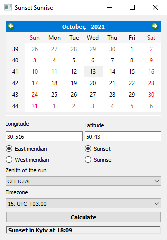

# Sunset Sunrise
The application calculates and displays the time of sunrise and sunset at the specified geographic coordinates.<br /><br />
<br /><br />
It has custom scripts feature for adding predefined geographic coordinates, which are called by the right mouse button on the application window. The custom scripts must be copied to the `scripts` folder, which is located in the application home folder.
### Examples of predefined scripts
#### For Kiev.js:
```javascript
longitude.setText(30.516);
latitude.setText(50.43);
east.setChecked(true);
timeZone.setCurrentIndex(16);
```
#### For Washington.js:
```javascript
longitude.setText(47.7511);
latitude.setText(120.7401);
east.setChecked(false);
timeZone.setCurrentIndex(5);
```
